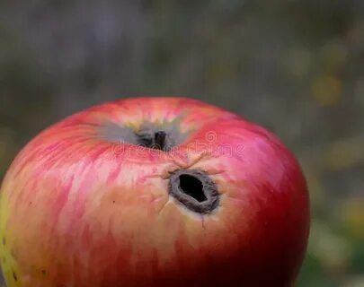
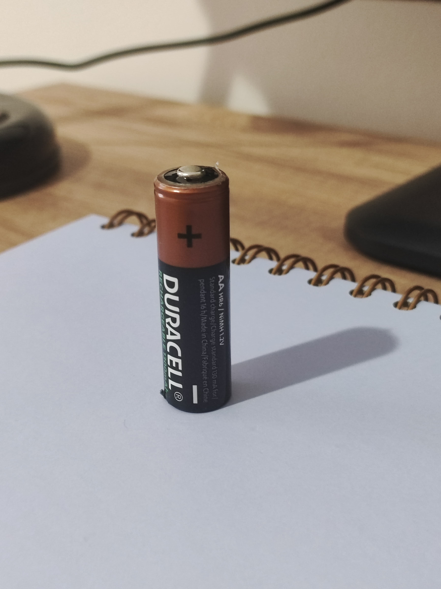
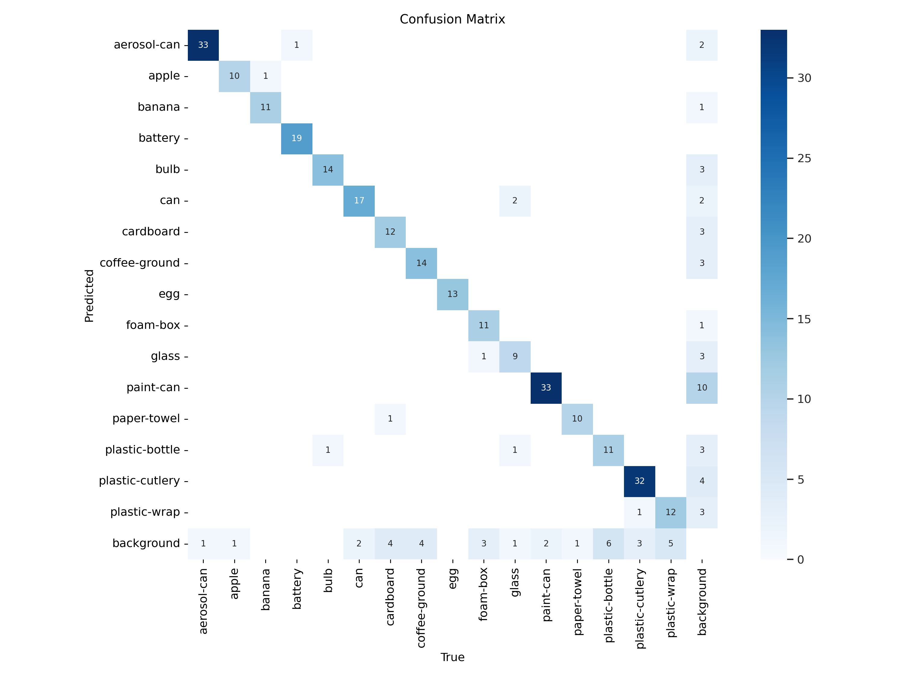

# Waste Detection using Deep Learning (YOLO11)
This repository contains the implementation of a waste detection and classification system based on the YOLO11 architecture. The project focuses on identifying 16 types of waste categorized into four main groups: General, Organic, Recyclable, and Hazardous waste.
## 📌 Project Preview
Proper waste separation at the household level remains a challenge. This study develops a deep learning model to automate the detection of various waste types to support future waste management applications.
### Key Features:
* Algorithm: YOLO11n (Nano) – chosen for its high speed and efficiency.
* Classes: 16 specific waste types (e.g., Plastic cutlery, Apple cores, Batteries, Glass bottles).
* Performance: Achieved an overall mAP50 of 0.89 and mAP50-95 of 0.76.
* 
## 📊 Dataset Specifications
The model was trained on a custom dataset collected from open-source platforms like [Roboflow](https://universe.roboflow.com/).
* Initial Dataset: 1,800 images (including 200 null/background images).
* Data Augmentation: Techniques included Horizontal Flip, Rotation (-15° to +15°), Hue/Saturation/Brightness adjustments, and Blur.
* Final Training Set: 4,440 augmented images.
### Sample Data
<p align="center"></p>

## 📈 Evaluation Results
The model demonstrated high accuracy across most classes, particularly for objects with distinct shapes:
* Highest Accuracy (mAP50 > 0.98): Aerosol cans, Apples, Batteries, Light bulbs, and Eggs.
* Overall Metrics:
  * Precision: 0.883 
  * Recall: 0.830 
  * mAP50: 0.890
 ### Sample Detection Results
| Organic | Hazardous | Recyclable |
|:---:|:---:|:---:|
|  |  |  |
| Apple (mAP: 0.98) | Battery (mAP: 0.98) | Can (mAP: 0.85) |
### Confusion Matrix:
<p align="center">
  
  <br>
  <em>Figure 1: Confusion Matrix showing 89% mAP performance.</em>
</p>

Note on Limitations: The model showed some confusion in classes like glass (often misidentified as paint-can) and plastic-wrap due to transparency and varying shapes
## 📂 Repository Structure
- `models/` : Contains the trained weights (best.pt).
- `notebooks/` : Jupyter notebook for training on Google Colab.
- `sample_data/` : Sample images use on trained model.
- `evaluation/` : Confusion matrix and performance charts.

## 🎓 Citation
If you use this work in your research, please cite:
```
Numpud, P., & Ninrutsirikun, U. (2025). Deep Learning-based Waste Detection using YOLO11. 
King Mongkut's University of Technology Thonburi.
